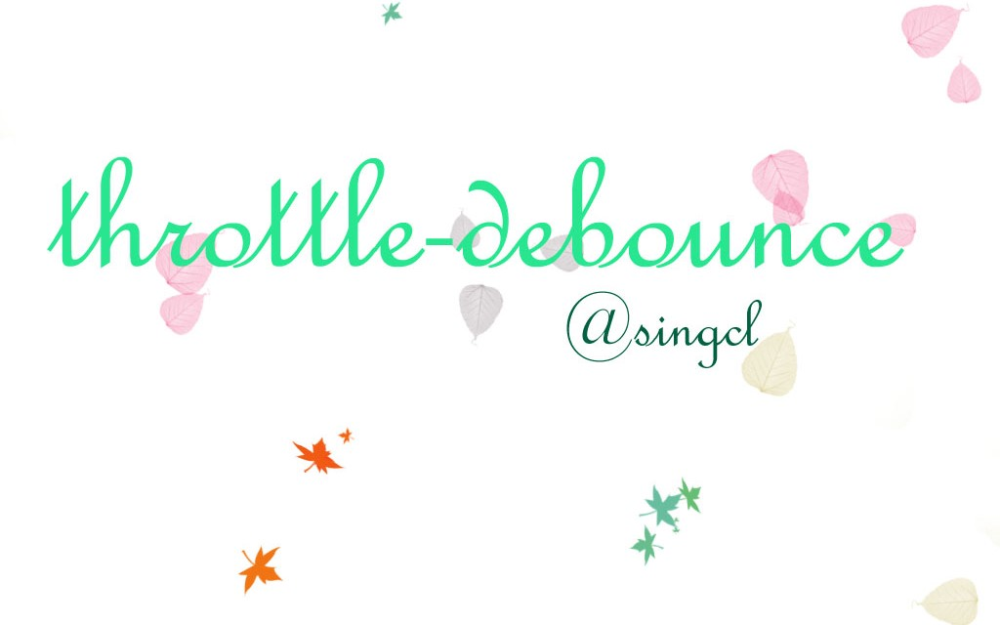

# throttle-debounce

[](https://www.travis-ci.org/singcl/throttle-debounce)
[](https://coveralls.io/github/singcl/throttle-debounce)
[](https://github.com/singcl/throttle-debounce)

Throttle/debounce your functions.

## 安装
```sh
npm i @singcl/throttle-debounce --save
```
## 基本用法

```js
var throttle = require('@singcl/throttle-debounce/throttle')
var debounce = require('@singcl/throttle-debounce/debounce')

throttle(500, function() {
	// 该函数为需要节流的目标函数
})

debounce(500, function() {
	// 该函数为需要去抖的目标函数
})
```
## API

### throttle

#### throttle(delay, callback)
| 参数 | 数据类型 | 参数描述 |
|:-----:|:-------:|:--------|
| delay| Number |节流时间。也就是频率，表示多久触发一次|
| callback| Function |目标函数。也就是我们需要节流的函数|

**Retrun**: 返回一个已经节流的函数.

**Example:**
```html
<!DOCTYPE html>
<html lang="en">
<head>
    <meta charset="UTF-8">
    <meta name="viewport" content="width=device-width, initial-scale=1.0">
    <meta http-equiv="X-UA-Compatible" content="ie=edge">
    <title>throttle(delay, callback)测试</title>
</head>
<body onscroll="throttled(event)">
    <div style="height: 10000px;">throttle(delay, callback)测试</div>
</body>
<script src="./lib/bundle.min.js"></script>
<script>
    var throttled = throttle(800, function scrollTest(e) {
        console.log(e, '正在滚动...')
    })
</script>
</html>
```

#### throttle(delay, noTrailing, callback)

| 参数 | 数据类型 | 参数描述 |
|:-----:|:-------:|:--------|
|delay|Number|节流时间。也就是频率，表示多久触发一次|
|noTrailing|Boolean|表示结束触发后最后是否会触发一次callback调用。false表示始终调用 true表示不调用
|callback|Function|目标函数。也就是我们需要节流的函数|

**Retrun**: 返回一个已经节流的函数.

throttle(delay, false, callback) 和 throttle(delay, callback)效果一样

**Example:**
```html
<!DOCTYPE html>
<html lang="en">
<head>
    <meta charset="UTF-8">
    <meta name="viewport" content="width=device-width, initial-scale=1.0">
    <meta http-equiv="X-UA-Compatible" content="ie=edge">
    <title>throttle(delay, true, callback)测试</title>
</head>
<body onscroll="throttled(event)">
    <div style="height: 10000px;">throttle(delay, true, callback)测试</div>
</body>
<script src="./lib/bundle.min.js"></script>
<script>
    var throttled = throttle(800, true, function scrollTest(e) {
        console.log(e, '正在滚动...')
    })
</script>
</html>
```

### debounce

#### debounce(delay, callback)
| 参数 | 数据类型 | 参数描述 |
|:-----:|:-------:|:--------|
| delay| Number |延迟时间。表示两次事件触发时间间隔如果小于delay, 则重新计时，知道大于delay才触发callback|
| callback| Function |目标函数。也就是我们需要去抖的函数|

**Retrun**: 返回一个已经去抖的函数.

**Example:**
```html
<!DOCTYPE html>
<html lang="en">
<head>
    <meta charset="UTF-8">
    <meta name="viewport" content="width=device-width, initial-scale=1.0">
    <meta http-equiv="X-UA-Compatible" content="ie=edge">
    <title>debounce(delay, callback)测试</title>
</head>
<body>
    <h3>debounce(delay, callback)测试</h3>
    <input type="text" oninput="debounced(event)">
</body>
<script src="./lib/bundle.min.js"></script>
<script>
    var debounced = debounce(800, function scrollTest(e) {
        console.log(e, '正在输入...')
    })
</script>
</html>
```

#### debounce(delay, atBegin, callback)
| 参数 | 数据类型 | 参数描述 |
|:-----:|:-------:|:--------|
| delay| Number |延迟时间。表示两次事件触发时间间隔如果小于delay, 则重新计时，知道大于delay才触发callback|
| atBegin| Boolen |表是在开始时候还是结束时候去抖|
| callback| Function |目标函数。也就是我们需要去抖的函数|

**Retrun**: 返回一个已经去抖的函数.

debounce(delay, false, callback) 和 debounce(delay, callback)效果一样，表示结束去抖

**Example:**
```html
<!DOCTYPE html>
<html lang="en">
<head>
    <meta charset="UTF-8">
    <meta name="viewport" content="width=device-width, initial-scale=1.0">
    <meta http-equiv="X-UA-Compatible" content="ie=edge">
    <title>debounce(delay, true, callback)测试</title>
</head>
<body>
    <h3>debounce(delay, true, callback)测试</h3>
    <input type="text" oninput="debounced(event)">
</body>
<script src="./lib/bundle.min.js"></script>
<script>
    var debounced = debounce(800, true, function scrollTest(e) {
        console.log(e, '正在输入...')
    })
</script>
</html>
```